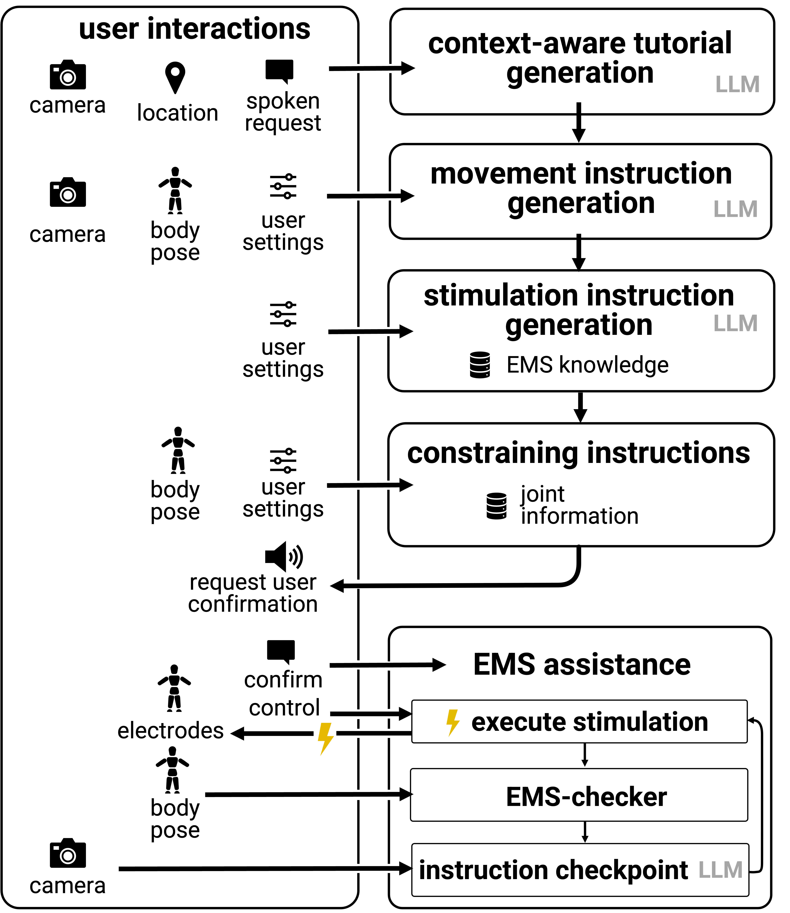

# Generative Muscle Stimulation: Providing Users with Physical Assistance by Constraining Multimodal-AI with Embodied Knowledge 

This repository includes the LLM (OpenAI GPT-4.1) prompts and EMS knowledge base for "Generative Muscle Stimulation: Providing Users with Physical Assistance by Constraining Multimodal-AI with Embodied Knowledge" (ACM CHI 2026). We provided Python code and Unity3D package for running our system (dependencies: openAI, TeslaSuit, MediaPipe, EMS-stimulator, etc—just to cite a few). Please visit https://embodied-ai.tech/ for more information.

## system diagram

## files

* **LLM-prompts folder** contains the prompts for each module. See system diagram for the information flow. Note that the example used in prompts are NOT used in the ablation evaluation, user study, examples in the paper, or video. All prompts are generic, thus, example-agnostic.
* **Knowledge-base folder**. We provide two knowledge bases: EMS knowledge and biomechanical knowledge: 
  * **EMS-knowledge.csv**. It is used in the stimulation instruction generation module. 
  * **joint-information.csv**. It is used for constraining instructions module
  * **user-setting-ems-parameters.csv**. Note that the EMS calibrations are required per-participant, which is why the parameters are not filled out in this file. As the EMS device is calibrated, this file should be populated with the settings that result from this calibration for each user. 
* **EMS-instructions-from-ablation-evaluation** contains all muscle stimulation instructions generated for the 12 tasks in the ablation evaluation, including the *ground truth*.
